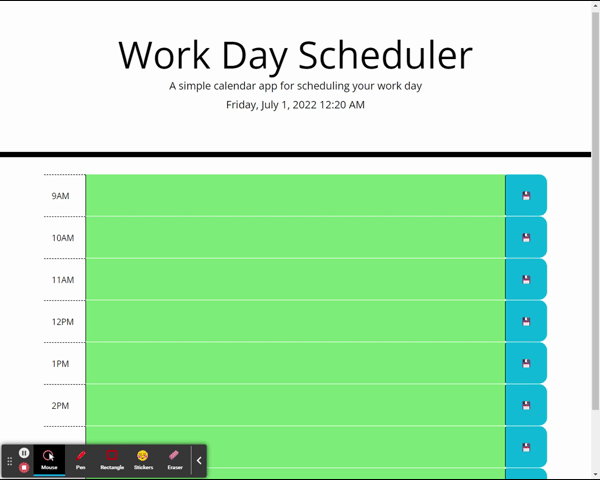
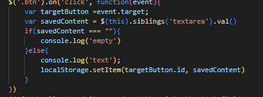

# workDayScheduler-HW5
# codingQuiz

[Link to the Live webpage](https://fiaschettima.github.io/workDayScheduler-HW5/)

## Description

This project is a simple day planer for your typical 9-5 workday. It will Highlight times of day (past,present and future) based off of the current time. The program will also allow you to save the information you entered to local storage, this way you can close the page and refresh and the information will stay in its palce.
This is all green because it is midnight so everything is future from midnight which is 0

---

Here's a few quick links:

* [Installation](#installation)
* [Code Snippets](#code-snippets)
* [Usage](#usage)
* [Technology used](#technology-used)
* [learning Points](#learning-points)
* [Credits](#credits)
* [License](#license)
* [Author](#author)
---

## Installation

To download the raw code of the page follow the steps below:
1. In the [Work Day Scheduler](https://github.com/fiaschettima/workDayScheduler-HW5) Repository copy the Code               
2. Open your version of terminal and enter > git clone git@github.com:fiaschettima/workDayScheduler-HW5 (Just paste the code you copied from previous step)
3. After that the code is now on your local machine and you are free to copy it to your own repository and make changes
 

---

## Code Snippets

This section of code adds an event listener to every button with class of btn on the page. It will then save the id of the button as the key to local storage. With the accompanying textarea information as the value to be pulled out later.

---
## Usage 

Track daily tasks keeping up with hourly progression.

---

## Technology Used
    -JQUERY
    -HTML
    -CSS
    -BootStrap
---
## Learning Points
    This project allowed me to get used to using local storage as well as using moment.js
---
## Problems faced
During the project I struggled in figuring out how to get the colors of the time areas to change based off of the current time. The result I used is not nearly what I had initially thought of. and I do believe there is a more efficent method.

---
## Credits

- [W3 Scools](https://www.w3schools.com/)
- [MarkDown Guide](https://github.com/adam-p/markdown-here/wiki/Markdown-Cheatsheet)

---
## License

    MIT License
---
## Author
    Matthew Fiaschetti 

[Github Profile](https://github.com/fiaschettima)
